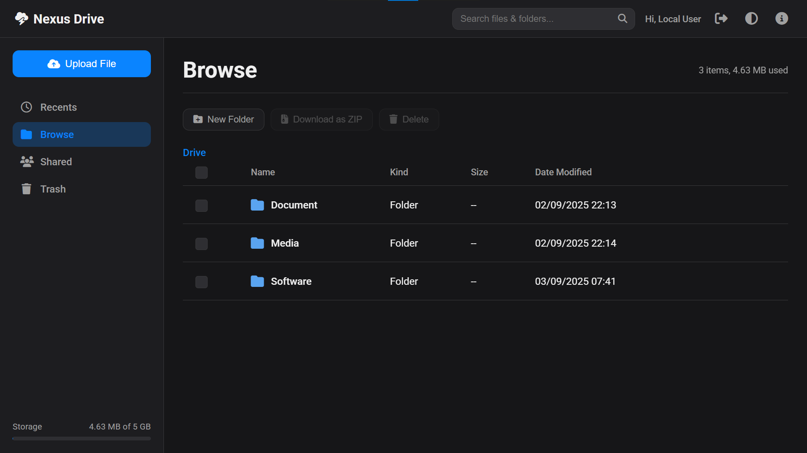

# Nexus Drive


*Giao diện chính của Nexus Drive*

## Giới thiệu

**Nexus Drive** là một giải pháp quản lý tệp tin tự host (self-hosted) đơn giản, mạnh mẽ và hiện đại. Được xây dựng bằng PHP và SQLite, ứng dụng này mang đến trải nghiệm lưu trữ đám mây mượt mà như một Single Page Application (SPA), với ưu điểm vượt trội là sự gọn nhẹ, dễ cài đặt và hoàn toàn di động. Bạn có thể tự lưu trữ, quản lý và chia sẻ các tệp cá nhân mà không phụ thuộc vào bất kỳ bên thứ ba nào.

## Tính năng nổi bật

*   **Trải nghiệm SPA (Single Page Application):** Điều hướng giữa các thư mục, thùng rác, tệp gần đây... mà không cần tải lại trang, mang lại cảm giác nhanh và mượt mà.
*   **Tự khởi tạo (Zero-Setup):** Tự động tạo cơ sở dữ liệu SQLite và cấu hình người dùng ngay lần đầu truy cập. Không cần bước cài đặt phức tạp.
*   **Di động tối đa:** Toàn bộ ứng dụng (mã nguồn, cơ sở dữ liệu, file người dùng) có thể được sao chép và di chuyển đến một máy chủ khác mà không cần cấu hình lại.
*   **Quản lý tệp toàn diện:**
    *   Tạo thư mục, đổi tên, xóa (vào thùng rác hoặc xóa vĩnh viễn).
    *   Kéo và thả để di chuyển tệp/thư mục.
    *   Khôi phục các mục từ thùng rác.
*   **Tải lên theo đoạn (Chunked Upload):** Hỗ trợ tải lên các tệp tin cực lớn, vượt qua giới hạn của cấu hình PHP truyền thống, đảm bảo độ ổn định và tin cậy.
*   **Nén và Tải về hàng loạt:** Chọn nhiều tệp/thư mục và tải chúng về dưới dạng một tệp ZIP duy nhất.
*   **Xem trước tệp đa năng:** Hỗ trợ xem trước nhiều định dạng phổ biến (hình ảnh, video, âm thanh, PDF, mã nguồn) trực tiếp trên trình duyệt.
*   **Tìm kiếm thông minh:** Tìm kiếm trực tiếp (live search) và tìm kiếm toàn bộ hệ thống.
*   **Chia sẻ dễ dàng:** Tạo và quản lý các liên kết chia sẻ công khai cho tệp tin.
*   **Hệ thống tài khoản linh hoạt:**
    *   Hỗ trợ đăng nhập, đăng ký (có thể bật/tắt) và đăng xuất.
    *   **Chế độ nhà phát triển:** Tùy chọn tắt hoàn toàn đăng nhập để tiện lợi khi làm việc trên `localhost`.
*   **Giao diện hiện đại:**
    *   Thiết kế tối giản, trực quan, hỗ trợ chế độ Sáng/Tối.
    *   Giao diện đáp ứng (responsive), hoạt động tốt trên cả máy tính và thiết bị di động.
    *   Hai chế độ xem: Danh sách (List View) và Lưới (Grid View).
*   **Thông tin lưu trữ:** Biểu đồ trực quan hóa dung lượng đã sử dụng và phân loại theo loại tệp.

## Yêu cầu

*   Máy chủ web (Apache với `mod_rewrite`, hoặc Nginx).
*   PHP 8.0 trở lên.
*   **PHP Extensions:**
    *   `pdo_sqlite` (bắt buộc, thường được bật sẵn).
    *   `zip` (bắt buộc, để tạo file nén).

## Cài đặt

1.  **Tải mã nguồn:** Tải về và giải nén toàn bộ mã nguồn của dự án.
2.  **Tải lên máy chủ:** Tải các tệp đã giải nén lên thư mục web của bạn (ví dụ: `public_html/` hoặc `htdocs/drive/`).
3.  **Quyền ghi:** Đảm bảo thư mục gốc của dự án có quyền ghi để PHP có thể tự động tạo các tệp `database/database.sqlite` và `users.php`.
    *   Trên Linux: `chmod -R 775 /path/to/your/drive` và `chown -R www-data:www-data /path/to/your/drive`.
4.  **Cấu hình máy chủ web:**
    *   **Apache:** Tệp `.htaccess` đã được cung cấp sẵn. Chỉ cần đảm bảo `mod_rewrite` đã được bật.
    *   **Nginx:** Bạn cần thêm cấu hình để xử lý các tệp `.mjs` và rewrite URL. Thêm vào khối `server` của bạn:
        ```nginx
        location / {
            try_files $uri $uri/ /index.php?$query_string;
        }

        types {
            text/javascript mjs;
        }
        ```
5.  **Truy cập:** Mở trình duyệt và truy cập vào URL của dự án. Ứng dụng sẽ tự động khởi tạo và chuyển bạn đến trang đăng nhập.

## Sử dụng

### 1. Tài khoản mặc định

*   **Tên đăng nhập:** `admin`
*   **Mật khẩu:** `admin`

Bạn nên đổi mật khẩu này ngay sau khi đăng nhập lần đầu.

### 2. Cấu hình nhanh

Mở tệp `bootstrap.php` để tùy chỉnh các cài đặt cốt lõi:

*   `define('APP_NAME', 'Nexus Drive');`: Đặt tên ứng dụng của bạn.
*   `define('AUTH_ENABLED', true);`:
    *   `true`: Bật hệ thống đăng nhập (khuyên dùng cho môi trường production).
    *   `false`: Tắt hoàn toàn đăng nhập, tự động đăng nhập với tên "Local User" (tiện lợi cho development).
*   `define('ALLOW_REGISTRATION', false);`:
    *   `true`: Cho phép người dùng tự đăng ký tài khoản mới.
    *   `false`: Tắt đăng ký. Chỉ có thể thêm người dùng bằng cách sửa tệp `users.php`.

### 3. Thêm người dùng thủ công

Để thêm người dùng mới khi đã tắt đăng ký, bạn cần tạo một mật khẩu đã được mã hóa.

1.  Tạo một tệp tạm thời, ví dụ `hash.php`, với nội dung sau:
    ```php
    <?php
    echo password_hash('your_new_password_here', PASSWORD_DEFAULT);
    ```
2.  Truy cập tệp `hash.php` qua trình duyệt.
3.  Sao chép chuỗi mã hóa vừa được tạo ra.
4.  Mở tệp `users.php` và thêm một dòng mới theo định dạng:
    ```php
    'new_username' => 'chuỗi_mã_hóa_bạn_vừa_sao_chép',
    ```
5.  **Quan trọng:** Xóa tệp `hash.php` ngay sau khi sử dụng để đảm bảo an toàn.

## Cấu trúc dự án (Đã tái cấu trúc)

*   `index.php`: Giao diện chính (View), bộ khung HTML và JavaScript phía client.
*   `api.php`: Cổng giao tiếp (API Gateway) xử lý tất cả logic nghiệp vụ, trả về dữ liệu JSON.
*   `bootstrap.php`: Tệp lõi của ứng dụng, chứa tất cả cấu hình, hàm tiện ích và kiểm tra xác thực.
*   `share.php`: Trang xem công khai cho các liên kết chia sẻ.
*   `login.php`, `register.php`, `logout.php`: Các trang xử lý xác thực người dùng.
*   `database/database.sqlite`: Tệp cơ sở dữ liệu.
*   `users.php`: Tệp lưu trữ thông tin người dùng.
*   `.htaccess`: Cấu hình cho máy chủ Apache.

## Cân nhắc bảo mật

*   **Quyền truy cập:** Trên môi trường production, hãy thiết lập quyền truy cập thư mục chặt chẽ. `755` cho thư mục và `644` cho tệp là một khởi đầu tốt.
*   **HTTPS:** Luôn sử dụng HTTPS để mã hóa dữ liệu truyền tải.
*   **Bảo vệ tệp dữ liệu:** Cấu hình máy chủ web của bạn (thông qua `.htaccess` hoặc Nginx config) để chặn truy cập trực tiếp vào các tệp nhạy cảm như `database.sqlite` và `users.php`.

## Giấy phép

Dự án này được phát hành dưới [Giấy phép MIT](LICENSE).


---
