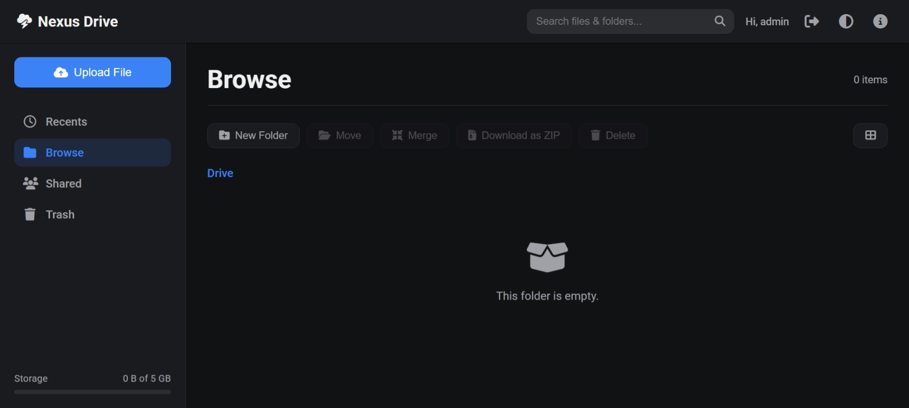

# Nexus Drive

*Giao diện chính của Nexus Drive*

## Giới thiệu

**Nexus Drive** là một giải pháp lưu trữ đám mây cá nhân (self-hosted cloud storage) mạnh mẽ, hiện đại và cực kỳ nhẹ. Được xây dựng bằng PHP và SQLite, Nexus Drive mang đến trải nghiệm người dùng mượt mà như các dịch vụ hàng đầu, gói gọn trong một kiến trúc đơn giản, di động và dễ triển khai.

Đây là giải pháp hoàn hảo cho những ai muốn toàn quyền kiểm soát dữ liệu của mình, với một giao diện đẹp mắt và các tính năng chuyên nghiệp mà không cần đến các hệ thống phức tạp.

## Tại sao chọn Nexus Drive?

*   **Trải nghiệm người dùng vượt trội:** Kiến trúc **Single Page Application (SPA)** giúp mọi thao tác điều hướng, quản lý tệp diễn ra tức thì, không cần tải lại trang.
*   **Hiệu suất đỉnh cao:** Tối ưu hóa từ backend đến frontend—từ **nén Gzip**, **phản hồi streaming** cho tốc độ tải file tối đa, đến **Optimistic UI** cho cảm giác phản hồi ngay lập tức.
*   **Di động tuyệt đối:** Toàn bộ ứng dụng, bao gồm cả cơ sở dữ liệu và nội dung file, đều nằm trong một thư mục duy nhất. Sao lưu, di chuyển hay triển khai chỉ đơn giản là sao chép và dán.
*   **Zero-Setup:** Không cần cài đặt phức tạp. Chỉ cần tải lên, cấp quyền và truy cập. Ứng dụng sẽ tự động khởi tạo mọi thứ cần thiết.

## Danh sách tính năng

### Quản lý & Tương tác
*   ✅ Giao diện SPA hiện đại, đáp ứng (responsive), hỗ trợ chế độ **Sáng/Tối**.
*   ✅ Hai chế độ xem: **Danh sách (List)** và **Lưới (Grid)**.
*   ✅ Quản lý tệp/thư mục: Tạo, Đổi tên, Xóa, Khôi phục.
*   ✅ Di chuyển tệp/thư mục đến bất kỳ đâu bằng **Modal Cây thư mục** hoặc **Kéo-thả**.
*   ✅ **Thùng rác** với khả năng khôi phục hoặc xóa vĩnh viễn.
*   ✅ Tải về hàng loạt dưới dạng file **ZIP**.

### Hiệu suất & Tập tin lớn
*   ✅ **Tải lên theo đoạn (Chunk Uploading):** Tải lên các tệp dung lượng cực lớn một cách ổn định.
*   ✅ **Tải về theo dòng (Streamed Downloads):** Tải xuống các tệp lớn ngay lập tức với mức sử dụng bộ nhớ server tối thiểu.
*   ✅ **Tối ưu hóa Gzip:** Giảm kích thước dữ liệu truyền tải, tăng tốc độ tải trang trên mạng chậm.

### Tiện ích & Chia sẻ
*   ✅ **Xem trước tệp đa năng:** Hỗ trợ xem trước hình ảnh, video, âm thanh, PDF, và mã nguồn.
*   ✅ **Tìm kiếm thông minh:** Tìm kiếm trực tiếp (live search) và tìm kiếm toàn trang.
*   ✅ **Chia sẻ nâng cao:**
    *   Đặt **mật khẩu** cho liên kết chia sẻ.
    *   Thiết lập **ngày hết hạn**.
    *   Tùy chọn **cho phép/không cho phép tải về**.
*   ✅ **Hệ thống tài khoản** linh hoạt với tùy chọn bật/tắt đăng ký.
*   ✅ **Chế độ Developer:** Tắt hoàn toàn xác thực để phát triển trên localhost.

## Yêu cầu

*   Máy chủ web (khuyên dùng Apache với `mod_rewrite`, hoặc Nginx).
*   PHP 8.0 trở lên.
*   **PHP Extensions:**
    *   `pdo_sqlite` (bắt buộc).
    *   `zip` (bắt buộc).

## Cài đặt nhanh

1.  **Tải mã nguồn:** Tải về và giải nén dự án.
2.  **Tải lên máy chủ:** Upload các tệp đã giải nén lên thư mục web của bạn.
3.  **Cấp quyền ghi:** Đảm bảo thư mục gốc của dự án và thư mục con `database/` có quyền ghi cho user của web server.
    *   *Trên Linux:* `chmod -R 775 /path/to/nexus-drive` và `chown -R www-data:www-data /path/to/nexus-drive`.
4.  **Truy cập:** Mở trình duyệt và truy cập vào URL của bạn. Ứng dụng sẽ tự động tạo cơ sở dữ liệu, tệp người dùng và đưa bạn đến trang đăng nhập.

**Tài khoản mặc định:**
*   **Tên đăng nhập:** `admin`
*   **Mật khẩu:** `admin`

## Cấu hình

Mở tệp `bootstrap.php` để tùy chỉnh các cài đặt chính:

*   `define('APP_NAME', 'Nexus Drive');`: Đặt tên ứng dụng của bạn.
*   `define('AUTH_ENABLED', true);`:
    *   `true`: Bật hệ thống đăng nhập (cho môi trường production).
    *   `false`: Tắt đăng nhập (cho development trên localhost).
*   `define('ALLOW_REGISTRATION', false);`:
    *   `true`: Cho phép người dùng tự đăng ký.
    *   `false`: Tắt đăng ký công khai.

## Cấu trúc dự án

*   `index.php`: Giao diện chính (View) và JavaScript phía client.
*   `api.php`: API Gateway xử lý tất cả logic nghiệp vụ.
*   `bootstrap.php`: Tệp lõi chứa cấu hình, hàm tiện ích, và kiểm tra xác thực.
*   `share.php`: Trang xem công khai cho các liên kết chia sẻ.
*   `login.php`, `register.php`, `logout.php`: Các trang xác thực.
*   `database/database.sqlite`: Tệp cơ sở dữ liệu SQLite.
*   `users.php`: Tệp lưu trữ thông tin người dùng.
*   `.htaccess`: Cấu hình cho máy chủ Apache.
*   `src/`: Thư mục chứa các tài nguyên như CSS, JS libraries, fonts, images.

## So sánh với Tiny File Manager

|                  | Nexus Drive                                                   | Tiny File Manager                                      |
| :--------------- | :------------------------------------------------------------ | :----------------------------------------------------- |
| **Triết lý**     | **Lưu trữ đám mây cá nhân** (như Google Drive)                | **Trình quản lý tệp server** (như cPanel)              |
| **Trải nghiệm**  | **SPA, hiện đại, mượt mà**                                    | MPA, truyền thống, chức năng                           |
| **Lưu trữ file** | Trong **CSDL SQLite (BLOB)**                                  | Trực tiếp trên **hệ thống file**                       |
| **Điểm mạnh**    | UX, tính di động, xử lý file lớn, an toàn cho người dùng cuối | Công cụ cho dev (editor, terminal), quản lý quyền file |
|                  |                                                               |                                                        |

## Giấy phép

Dự án này được phát hành dưới [Giấy phép MIT](LICENSE).

---